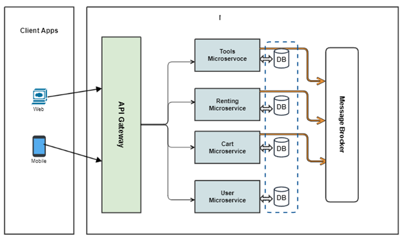

# Big tools renting application using Microservices
**_A Renting application built using modern technologies and  AWS Cloud Microservices Architecture patterns._**
- **Framework and Languages** (Java - Spring Boot/Cloud, Python - FastAPI, SQLAlachamey, JavaScript/TypeScript - Node, ExpressJS, React)
- **Databases** (Redis, ElastiSearch, PostgreSQL)

The demonstration is to code and test a simple tool rental application.
- The application is a point-of-sale tool for a store, like Home Depot, that rents big tools.
- Customers rent a tool for a specified number of days.
- When a customer checks out a tool, a Rental Agreement is produced.
- The store charges a daily rental fee, whose amount is different for each tool type.
- Some tools are free of charge on weekends or holidays.
- Clerks may give customers a discount that is applied to the total daily charges to reduce the final
charge.

_You can run the application locally on your laptop/desktop with few steps and also to AWS._

## UI/UX, Architecture & Technologies

Architecture         |  Application UI/UX
:-------------------------:|:-------------------------:
 |  

## Functional Microservices
| Microservice                                              | Description                                                          | Technologies Used                                                                                              |
|-----------------------------------------------------------|----------------------------------------------------------------------|----------------------------------------------------------------------------------------------------------------|
| [Tool Catalog Microservice](tools-microservice/README.md) | Provides tools description and details.                              | A REST API built using NodeJS, ExpressJS relies PostgreSQL as  data store.                                     | 
| [Shopping Cart Microservice](cart-microservice/README.md) | A Microservice with shopping cart.                                   | A REST API built using Spring Boot & Cloud with Gradle as build tool, leverages Redis as in-memory data store. |
| [Renting Microservice](renting-microservice/README.md)    | A Microservice for renting and checkout features.                    | A REST API built using Spring Boot & Cloud with Gradle as build tool, leverages Redis as in-memory data store. |
| [User Profile Microservice](users-microservice/README.md) | User profile management, account and more.                           | A REST API built using Python FastAPI and SQLAlchamey used PostgreSQL                                          |
| [Store UI](store-ui/README.md)                            | A web UI frontend for e-commerce store that uses above Microservices | A web app built using React, Material UI using TypeScript/JavaScript                                           |

## Improvement and data collection Microservices
| Microservice                                         | Description                                                                           | Technologies Used                     |
|------------------------------------------------------|---------------------------------------------------------------------------------------|---------------------------------------|
| [Search Microservice](search-microservice/README.md) | Enables seach functionality such as auto complete, typeahead, faceted search features | A proxy to ElasticSearch, leverages Node |
| [Search Microservice](ai-microservice/README.md)     | Enables AI machine learning                                                           | PyTorch                                  |

## Folder Structure
```bash
.
├── store-ui                    # Web Store Ract App with Material UI
│   └── ...
├── cart-microservice           # Shopping Cart Microservice repository
├── renting-microservice        # Renting and checkout repository
├── tools-microservice          # Tool Catalog Microservice folder
├── users-microservice          # User Profile Management Microservice
├── search-microservice         # Search Microservice
├── ai-microservices            # Enables AI machine learning
└── infra                       # Infrastructure scripts to setup app locally & cloud
    ├── k8s                     # Kubernetes (k8s) YAML files
    │    └── apps               # Microservices related k8s yaml files.
    │    └── shared-services    # Databases, ElasticSeach related k8s yaml files.
    ├── terraform               # Terraform scripts to deploy to AWS
    └── performance             # Performance and load testing scripts
```

## Getting Started

### Build
Go through detailed instructions specified in README.md file of each microservice.

### Deploy
Refer to [instructions](infra/README.md) to deploy application and dependent services such as Postgres, Redis, ... either to local machine or AWS.
